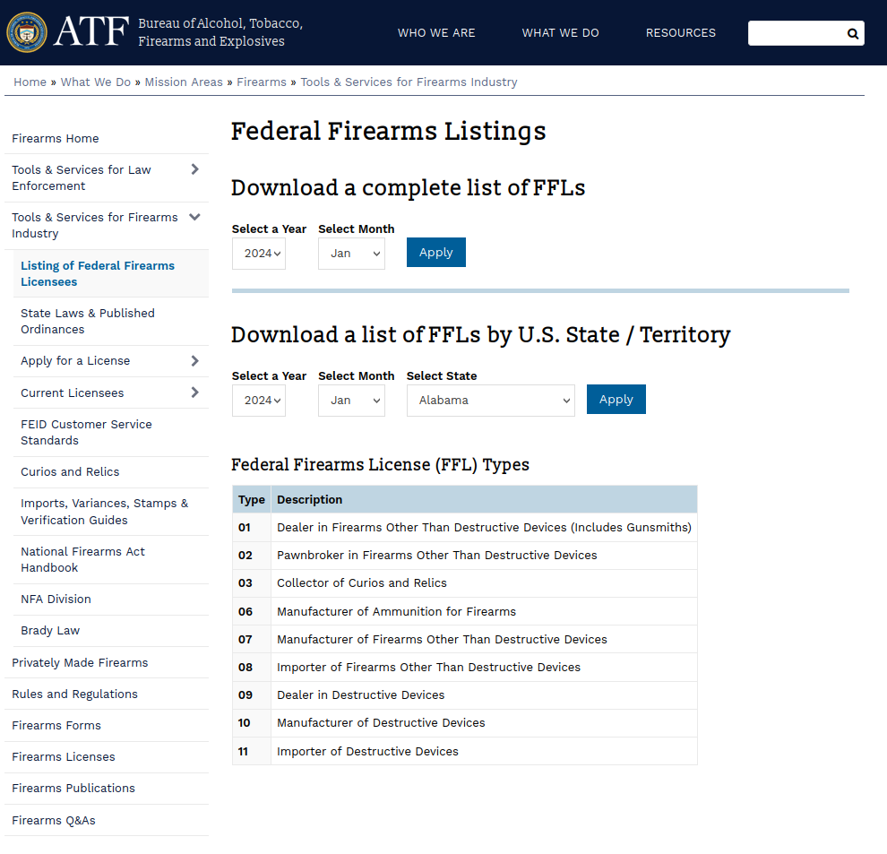
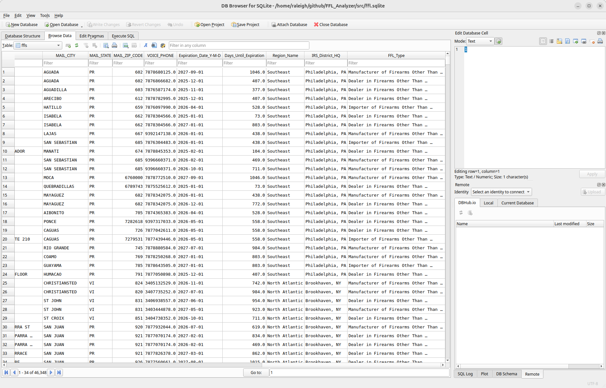

# About

This repository has some very simple Python scripts to help you view the ATF's Federal Firearms Listings' database.

Download the current list of FFLs from the ATF website: https://www.atf.gov/firearms/listing-federal-firearms-licensees



You'll get a text file.

Install the dependencies and run the script:

```bash
$ pip install -r requirements.txt
$ python3 ffl_analyzer.py -f <PATH-TO-ATF-TEXT-FILE>
```

The scripts in this repo will load it as a Pandas dataframe, and add the following columns:

* IRS District nme
* ATF Region code
* FFL Expiration date (YYYY-MM-DD)
* FFL Type description

It will then save the dataframe as an SQL database which you can load into any database viewer.




# Roadmap

* Add support for decoding FIPS codes